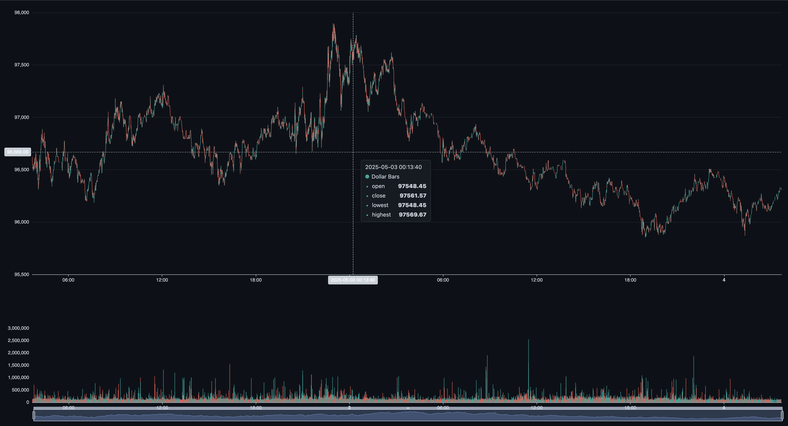

# bprocs (bar processing scripts)



This repo houses a CLI tool for pulling aggregated trade data from binance spot markets and resampling them into both time-discretized and quote-discretized OHLCV charts. It also has a minimal web UI that is able to load in dataset files made by the cli, for visualization purposes. It supports visualing both timebars and quotebars.

### Install

Assuming you have a local python installation:

```bash
git clone <REPO_URL>
cd bprocs/
source venv/bin/activate
pip install -r requirements.txt
```

### Some commands

Pulling aggregated trade data for a Binance spot market for the last n days. Outputs a csv file:

`python cli.py fetch-trades <SYMBOL> <DAYS> <OUTPUT_FILE> <START_NOW>`

- `python cli.py fetch-trades SOLUSDT 2 trades.csv`
- `python cli.py fetch-trades BTCUSDT 7 trades.csv false`
- `python cli.py fetch-trades ETHUSDT 11 trades.csv true`

---

Resample the trades in a csv into time-discretized OHLCV data:

`python cli.py timebars <PERIOD> <INPUT_FILE> <OUTPUT_FILE>`

- `python cli.py timebars 1 trades.csv timebars.csv`
- `python cli.py timebars 10 trades.csv timebars.csv`
- `python cli.py timebars 101 trades.csv timebars.csv`

---

Resample the trades in a csv into quote-discretized OHLCV data:

`python cli.py quotebars <INPUT_FILE> <OUTPUT_FILE> <BAR_CONFIG_PATH>`

- `python cli.py quotebars my_trades.csv dollar_bars_100k.csv --dollar-size 100000`
- `python cli.py quotebars my_trades.csv my_dollar_bar_output.csv --dollar-size 50000`

-- this is basically just dollar bars for stablecoin markets. pretty nice for ml stuff, de prado has a nice book outlining why

---
